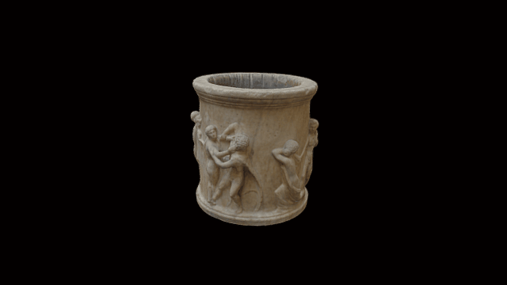

 

# The Townley Well-head
3D data for recreation of a British Museum object.

Pentelic marble well-head (puteal) decorated with four scenes of erotic pursuit: Hercules in female dress seizing Omphale, flanked on the left by a vase and on the right by a flying Cupid holding a sceptre; a female figure struggling with a male, thought to resemble Hercules; a female figure seized by a young satyr carrying a wineskin; and a young Hermaphrodite attempting to escape from a bearded satyr, who is seated on a rock under a palm tree.

COL: GAA8749

Diameter: 84 cm HeightL 81.9cm

# LICENSE
The contents of this repository are licensed under CC-BY-NC-SA

# Credits
Photographs and models by Daniel Pett <dpett@britishmuseum.org>, Digital Humanities Lead, British Museum
144 photographs, Nikon D5100, Agisoft Pro, 10 minute scan 2/5/17 by Daniel Pett. False bottom added to model in Blender.
